# ML Design

## MACHINE LEARNING DESIGN INTERVIEW
_by Khang Pham_

## Table of contents

* [Chapter 1]
   * [Feature Selection and Feature Engineering](#feature-selection-and-feature-engineering)
     - [Categorical Features](#categorical-features)
* [Chapter 2]
    * [Training Pipeline](#training_pipeline)
    
## Chapter 1

## Feature Selection And Feature Engineering

### Categorical Features
* **The problem with One Hot Encoding**

Tree-based models, such as decision trees, random forests, and boosted trees, don’t perform well with one hot encodings, especially when the tree has many levels (i.e., when there are values of categorical attributes). This is because they pick the feature to split, based on how well splitting the data on that feature will “purify” it. If we have several levels, only a small fraction of the data will usually belong to any given level, so the one hot encoded columns will be mostly zeros. Since splitting on this column will only produce a small gain, tree-based algorithms typically ignore the information in favor of other columns. This problem persists, regardless of the volume of data you actually have. Linear models or deep learning models do not have this problem.

* **Best Practices**
When levels (categories) are not important, we can group them together in ”Other” class.

* Feature Hashing
Feature hashing, or hashing trick, converts text data, or categorical attributes with high cardinalities, into a feature vector of arbitrary dimensionality.
 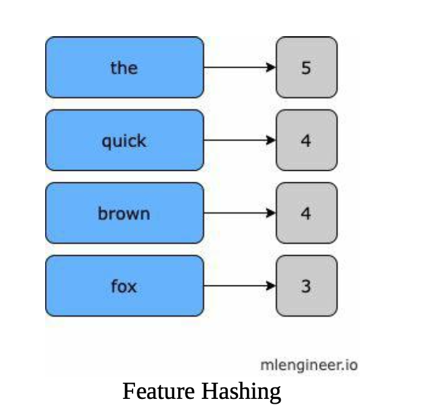

* Embedding
In practice, there are two ways to train embedding: pre-trained embedding i.e: word2vec2 style or cotrained, (i.e., YouTube video embedding).

There are two ways to formulate the problems: Continuous Bag of Words
(CBOW) and Skip-gram. For CBOW, we want to predict one word based on the surrounding words. For example, if we are given: word1 word2 word3 word4 word5, we want to use (word1, word2, word4, word5) to predict word3.
CBOW. Source: Exploiting Similarities Among Languages for Machine Translation
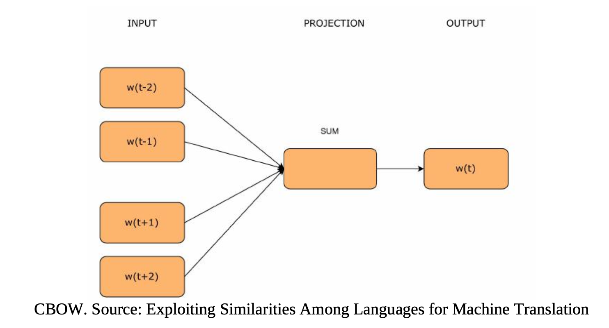

In the skip-gram model, we use ’word3’ to predict all surrounding words ’word1, word2, word4, word5’.
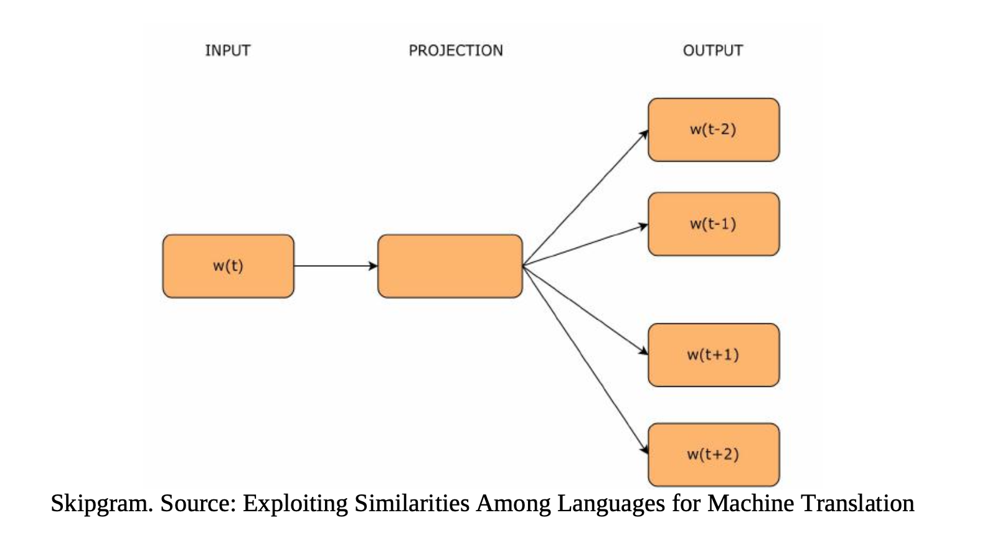

#### Companies using word2vec method to train embedding?
- Instagram’s personalized recommendation model uses word2vec style where each user session can be viewed as: account 1 →\rightarrow account 2 →\rightarrow account 3 to predict accounts with which a person is likely to interact within a given session.
- Pinterest Ads ranking uses word2vec style where each user session can be viewed as: pin A →\rightarrow pin B →\rightarrow pin C, then co- trained with multitask modeling.
- DoorDash personalized store feed uses word2vec style where each user session can be viewed as: restaurant 1 →\rightarrow restaurant 2 → \rightarrow restaurant 3. This Store2Vec model can be trained to predict if restaurants were visited in the same session using CBOW algorithm.

#### How does DoorDash Train Embedding?
For each session, we assume users may have a certain type of food in mind, and they view store A, store B, etc. We can assume these stores are somewhat similar to the user’s interests. We can train a model to classify a given pair of stores if they show up in a user session. 
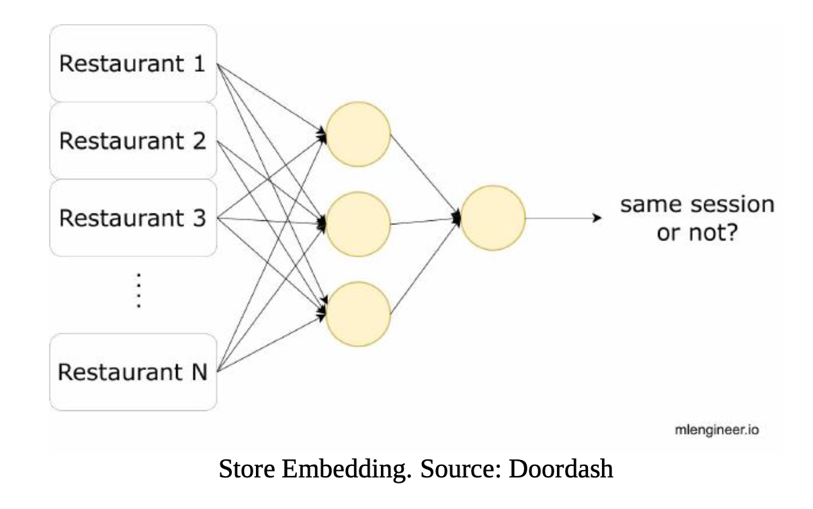

#### How does YouTube Train Embedding?

Recommendation System usually consists of three stages: **Retrieval, Ranking and Re-ranking** (read Chapter [rec-sys]). In this example, we will cover how YouTube builds **Retrieval** (Candidate Generation) component using Two- tower architecture.

We have two towers: left tower takes (users, context) as input and right tower takes movies as input.
- Given input x (user, context), we want to pick candidate y (videos) from all available videos.
- A common choice is to use Softmax function
$$P(y| x; \theta) = \frac{e^{s(x, y)}}{\sum_{i=1} e^{s(x, y_i)}}$$
- Loss function: use log-likelihood $$L = - \frac{1}{T} \sum_{i=1}^T \log(P(y_i|x_i;\theta))$$
- As a result, the two-tower model architecture is capable of modeling the situation where the label has structures or content features.
- StringLookup api maps string features to integer indices.
- Embedding layer API turns positive integers (indexes) into dense vectors of fixed size.
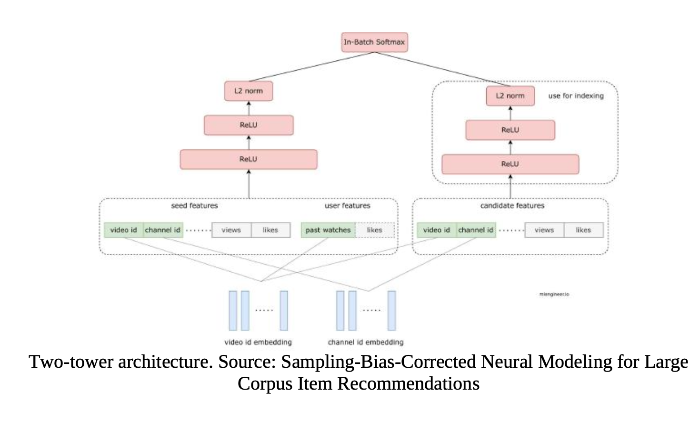

* Key Questions:
  - inventory too huge => Solution: for each mini-batch, we sampled data from our videos corpus as negative samples. One example is to use power-law distribution for sampling.
  - When sampling, it’s possible that popular videos are overly penalized as negative samples in a batch. Does it introduce bias in our training data? One solution is to “correct” the logit output $$sc(xi,yj)=s(xi,yj) −\log(p_j)s^c(x_i, y_j) = s(x_i, y_j) - \log(p_j)$$. Here $p_j$ means the probability of selecting video j. 
    
#### How does LinkedIn Train Embedding?

LinkedIn used Hadamard product for Member Embedding and Job Embedding.
The final prediction is a logistic regression on the Hadamard product between each seeker and job posting pair.
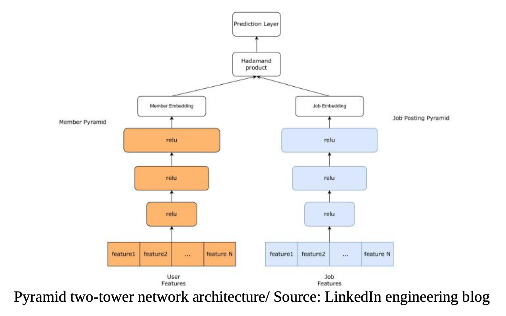

$$[1234]⊙[5326]=[56624]$$

$$  
\begin{equation}
  \begin{aligned}
    \begin{bmatrix}
    1 & 2\\ 
    3 & 4 
    \end{bmatrix}
    \odot 
    \begin{bmatrix} 
    5 & 3 \\
    2 & 6 
    \end{bmatrix} = 
    \begin{bmatrix} 
    5 & 6\\ 
    6 & 24 
    \end{bmatrix}
  \end{aligned}
\end{equation}
$$

#### How does Pinterest Train Embedding?
When users search for a specific image, Pinterest uses input pins visual embedding and search for similar pins. How do we generate visual embedding? Pinterest used image recognition deep learning architecture, e.g., VGG16, ResNet152, Google Net, etc., to fine tune on the Pinterest dataset. The learned features will then be used as embedding for Pins. 

### How do we Evaulate the Quality of embedding?

There are two methods:
* Apply embedding to downstream tasks and measure their model performance. For certain applications, like natural language processing (NLP), we can also visualize embeddings using t-SNE (t-distributed stochastic neighbor embedding), EMAP.
* Apply clustering (kmeans, k-Nearest Neighbor) on embedding data and see if it forms meaningful clusters.

### Measuring Similarities

- Dot Product
- Cosine
- Euclidian
  
* Dot product tends to favor embeddings with high norm. It’s more sensitive to the embeddings norm compared to other methods. Because of that it can create some consequences
Popular content tends to have higher norms, hence ends up dominating the recommendations. 

### Numeric Features
#### Normalization
$$ v = \frac{v - \overrightarrow{v}_{min}}{\overrightarrow{v}_{max} - \overrightarrow{v}_{min}} $$
#### Standardization
$$ v = \frac{v - \overrightarrow{v}_{mean}} {\overrightarrow{v}_{std}}

If the feature distribution resembles power laws we can transform it by using the formula: $ \log(1+v1+median_of_v)\log\left(\frac{1 + v}{1 + \text{median\_of\_}v}\right)$. In practice, normalization can cause an issue because the values of min and max are usually outliers. One possible solution is “clipping”, where we pick a “reasonable” value for min and max.

# Chapter 2
## Training Pipeline

### Handle Imbalance Class Distribution
* Use class weights in the loss function
  - `loss_function = -w0 * ylog(p) - w1*(1-y)*log(1-p)`
* Use naive resampling
  - It’s important to have validation data and test data intact (no resampling).
  - Downsample: $ example_weight=original_weight*downsampling_factor\text{example\_weight} = \text{original\_weight} * \text{downsampling\_factor} $
* Use synthetic resampling: synthetic minority over-sampling technique (SMOTE)
  - It works by randomly picking a point from the minority class and computing the k-nearest neighbors for this point. The synthetic points are added between the chosen point and its neighbors. 
  - In practice, this method is not commonly used, especially for large-scale applications.
    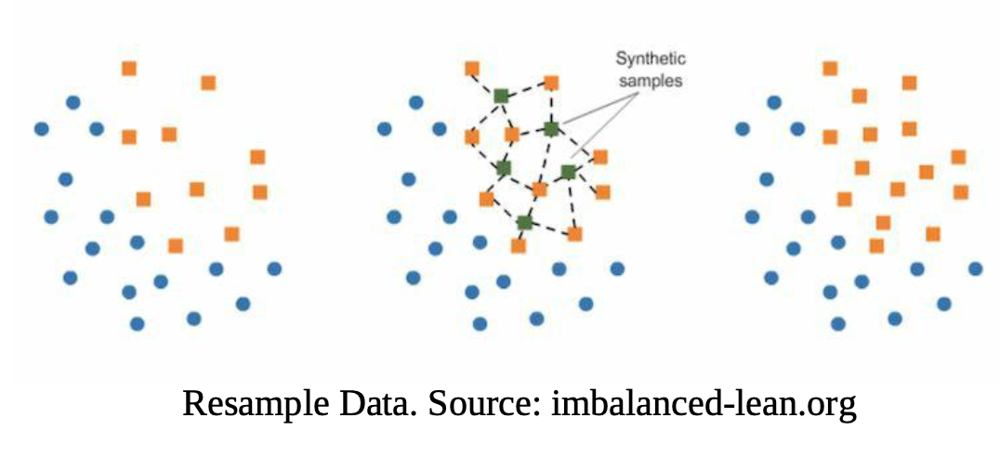

### How to Generate Data
#### Cold Start
   - E.g. LinkedIn pair users with courses
     - Course to Skill:
       - Hire Human Tagger
       - Build (semi)supervised model to predict, labels from previous taggers
     - User to Skill
       - User provide skill volunteerarily
       - Build scorecard model based on user's profile(e.g. title, industry)
#### How to Split Data
  * 对于时间序列预测，可以用
    - sliding window
    - explanding window
  * Re-training 是很必要的
## Loss Funciton and Metrics Evaluation
### Regression Loss
#### MSE and MAE
$$ MSE=1N∑i=1n(targeti−predictioni)2MSE = \frac{1}{N} \sum_{i=1}^n (\text{target}_i - \text{prediction}_i)^2$$
$$ MAE=1N∑i=1n|targeti−predictioni|MAE = \frac{1}{N} \sum_{i=1}^n |\text{target}_i - \text{prediction}_i$｜$$

#### Huber Loss
Huber Loss fixed the outlier-sensitive problem of MSE, and it’s also differentiable at 0. if the error is not too big, Huber loss uses MSE; otherwise, it’s just MAE with some penalty.
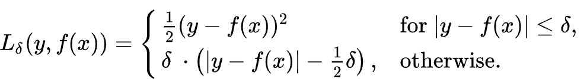

#### Quantile Loss
In certain applications, we value underestimation vs. overestimation differently. Quantile loss can give more value to positive error or negative error. 
`max(q * (y-y_pred), (1-q) * (y_pred-y))`
>Uber uses pseudo-Huber loss and log-cosh loss to approximate Huber loss and Mean Absolute Error in their distributed XGBoost training. Doordash Estimated Time Arrival models uses MSE then they move to Quantile loss and Custom Asymmetric

### Classification Loss
#### Normalized Cross Entrophy

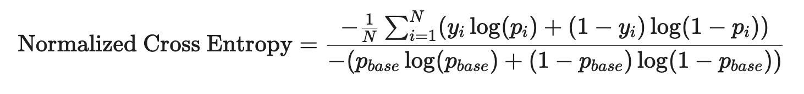
where $p_{base}$ is the probabily of positive samples.

- The lower the value, the better the model’s prediction.
- The reason for this normalization is that the closer the background CTR is to either 0 or 1, the easier it is to achieve a better log loss.
- Dividing by the entropy of the background CTR makes the NE insensitive to the background CTR.

#### Focal Loss
All the hard(or misclassified — false negatives) samples are given more weight while learning than easy(correctly classified — true negatives) examples. $\alpha$ and $\gamma$ are both hyperparemeter, $\gamma$ control the penality given to the misclassified samples.

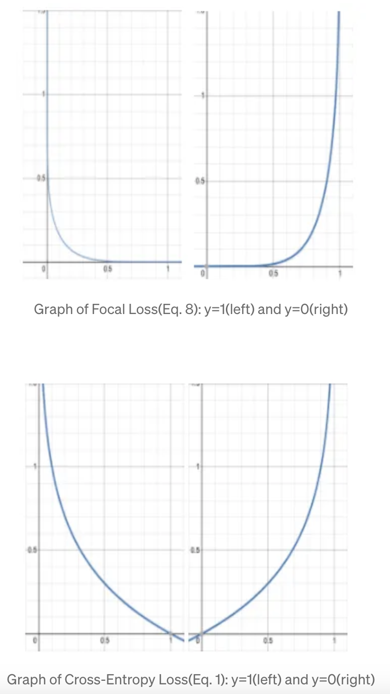

#### Hinge Loss
The hinge loss is a special type of cost function that not only penalizes misclassified samples but also correctly classifies ones that are within a defined margin from the decision boundary. It is first used in SVM.
$$ \L = \max(0, 1- y \dot \hat{y}) $$
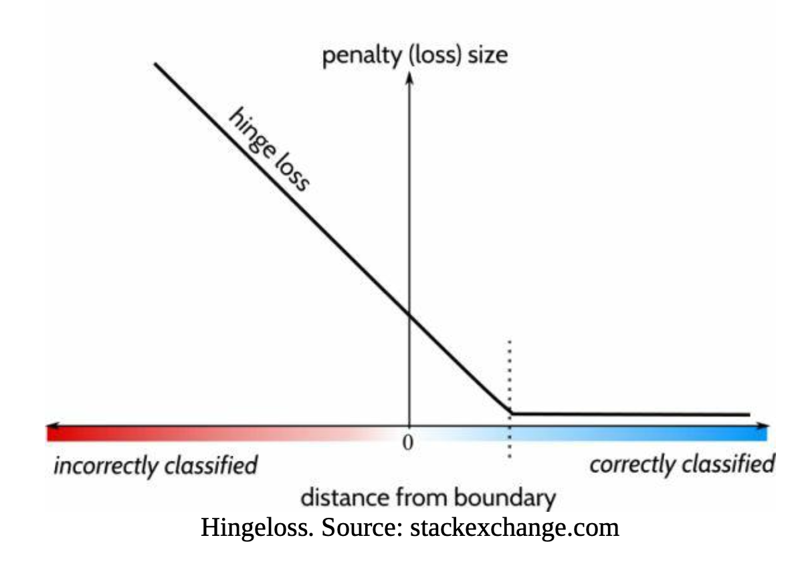

### Metrics Evaluation
#### Offline
* e.g. $R^2$, MAE/MSE, Log Loss
* ROC - AUC
  `TP vs FP`
* PR - AUC
  `Precision vs Recall`
  - Equivalent to 
* Precision vs Recall vs F1
  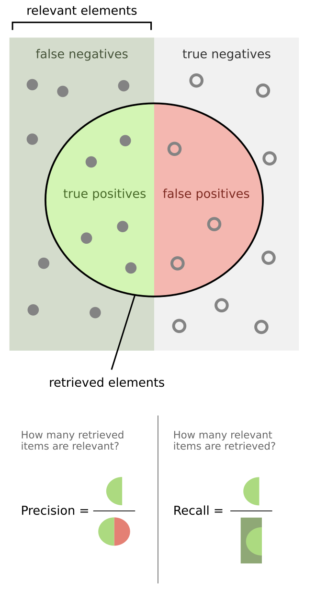
  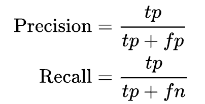
  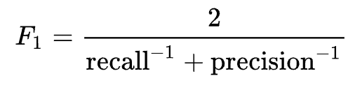
* Precision@k, Recall@k
* MAP
* Mean Reciprocal Rank(MRR)
  - It’s more popular in the research community. It measures how far down the ranking the FIRST relevant document is. If MRR is close to 1, it means relevant results are close to the top of search results. Lower MRR indicates poorer search quality, with the right answer farther down in the search results.
  $$ MRR = \frac{1}{n} \sum_{i=1}^n\frac{1} {\text{rank}_i} $$
  - If you care about more than one correct result, you should NOT use this metric.

  
  
  
  

    

