# ML Design

## MACHINE LEARNING DESIGN INTERVIEW
_by Khang Pham_

## Table of contents

* [Chapter 1]
   * [Feature Selection and Feature Engineering](#feature-selection-and-feature-engineering)
     - [Categorical Features](#categorical-features)
* [Chapter 2]
    * [Training Pipeline](#training_pipeline)
    * [A/B Testing Fundamental](#a_b_testing_fundamental)
    * [Common Deployment Patterns](#common_deployment_patterns)
    
## Chapter 1

## Feature Selection And Feature Engineering

### Categorical Features
* **The problem with One Hot Encoding**

Tree-based models, such as decision trees, random forests, and boosted trees, don’t perform well with one hot encodings, especially when the tree has many levels (i.e., when there are values of categorical attributes). This is because they pick the feature to split, based on how well splitting the data on that feature will “purify” it. If we have several levels, only a small fraction of the data will usually belong to any given level, so the one hot encoded columns will be mostly zeros. Since splitting on this column will only produce a small gain, tree-based algorithms typically ignore the information in favor of other columns. This problem persists, regardless of the volume of data you actually have. Linear models or deep learning models do not have this problem.

* **Best Practices**
When levels (categories) are not important, we can group them together in ”Other” class.

* Feature Hashing
Feature hashing, or hashing trick, converts text data, or categorical attributes with high cardinalities, into a feature vector of arbitrary dimensionality.
 

* Embedding
In practice, there are two ways to train embedding: pre-trained embedding i.e: word2vec2 style or cotrained, (i.e., YouTube video embedding).

There are two ways to formulate the problems: Continuous Bag of Words
(CBOW) and Skip-gram. For CBOW, we want to predict one word based on the surrounding words. For example, if we are given: word1 word2 word3 word4 word5, we want to use (word1, word2, word4, word5) to predict word3.
CBOW. Source: Exploiting Similarities Among Languages for Machine Translation

In the skip-gram model, we use ’word3’ to predict all surrounding words ’word1, word2, word4, word5’.

#### Companies using word2vec method to train embedding?
- Instagram’s personalized recommendation model uses word2vec style where each user session can be viewed as: account 1 →\rightarrow account 2 →\rightarrow account 3 to predict accounts with which a person is likely to interact within a given session.
- Pinterest Ads ranking uses word2vec style where each user session can be viewed as: pin A →\rightarrow pin B →\rightarrow pin C, then co- trained with multitask modeling.
- DoorDash personalized store feed uses word2vec style where each user session can be viewed as: restaurant 1 →\rightarrow restaurant 2 → \rightarrow restaurant 3. This Store2Vec model can be trained to predict if restaurants were visited in the same session using CBOW algorithm.

#### How does DoorDash Train Embedding?
For each session, we assume users may have a certain type of food in mind, and they view store A, store B, etc. We can assume these stores are somewhat similar to the user’s interests. We can train a model to classify a given pair of stores if they show up in a user session. 

#### How does YouTube Train Embedding?

Recommendation System usually consists of three stages: **Retrieval, Ranking and Re-ranking** (read Chapter [rec-sys]). In this example, we will cover how YouTube builds **Retrieval** (Candidate Generation) component using Two- tower architecture.

We have two towers: left tower takes (users, context) as input and right tower takes movies as input.
- Given input x (user, context), we want to pick candidate y (videos) from all available videos.
- A common choice is to use Softmax function
$$P(y| x; \theta) = \frac{e^{s(x, y)}}{\sum_{i=1} e^{s(x, y_i)}}$$
- Loss function: use log-likelihood $$L = - \frac{1}{T} \sum_{i=1}^T \log(P(y_i|x_i;\theta))$$
- As a result, the two-tower model architecture is capable of modeling the situation where the label has structures or content features.
- StringLookup api maps string features to integer indices.
- Embedding layer API turns positive integers (indexes) into dense vectors of fixed size.

* Key Questions:
  - inventory too huge => Solution: for each mini-batch, we sampled data from our videos corpus as negative samples. One example is to use power-law distribution for sampling.
  - When sampling, it’s possible that popular videos are overly penalized as negative samples in a batch. Does it introduce bias in our training data? One solution is to “correct” the logit output $$sc(xi,yj)=s(xi,yj) −\log(p_j)s^c(x_i, y_j) = s(x_i, y_j) - \log(p_j)$$. Here $p_j$ means the probability of selecting video j. 
    
#### How does LinkedIn Train Embedding?

LinkedIn used Hadamard product for Member Embedding and Job Embedding.
The final prediction is a logistic regression on the Hadamard product between each seeker and job posting pair.

$$[1234]⊙[5326]=[56624]$$

$$  
\begin{equation}
  \begin{aligned}
    \begin{bmatrix}
    1 & 2\\ 
    3 & 4 
    \end{bmatrix}
    \odot 
    \begin{bmatrix} 
    5 & 3 \\
    2 & 6 
    \end{bmatrix} = 
    \begin{bmatrix} 
    5 & 6\\ 
    6 & 24 
    \end{bmatrix}
  \end{aligned}
\end{equation}
$$

#### How does Pinterest Train Embedding?
When users search for a specific image, Pinterest uses input pins visual embedding and search for similar pins. How do we generate visual embedding? Pinterest used image recognition deep learning architecture, e.g., VGG16, ResNet152, Google Net, etc., to fine tune on the Pinterest dataset. The learned features will then be used as embedding for Pins. 

### How do we Evaulate the Quality of embedding?

There are two methods:
* Apply embedding to downstream tasks and measure their model performance. For certain applications, like natural language processing (NLP), we can also visualize embeddings using t-SNE (t-distributed stochastic neighbor embedding), EMAP.
* Apply clustering (kmeans, k-Nearest Neighbor) on embedding data and see if it forms meaningful clusters.

### Measuring Similarities

- Dot Product
- Cosine
- Euclidian
  
* Dot product tends to favor embeddings with high norm. It’s more sensitive to the embeddings norm compared to other methods. Because of that it can create some consequences
Popular content tends to have higher norms, hence ends up dominating the recommendations. 

### Numeric Features
#### Normalization
$$ v = \frac{v - \overrightarrow{v}_{min}}{\overrightarrow{v}_{max} - \overrightarrow{v}_{min}} $$
#### Standardization
$$ v = \frac{v - \overrightarrow{v}_{mean}} {\overrightarrow{v}_{std}}

If the feature distribution resembles power laws we can transform it by using the formula: $ \log(1+v1+median_of_v)\log\left(\frac{1 + v}{1 + \text{median\_of\_}v}\right)$. In practice, normalization can cause an issue because the values of min and max are usually outliers. One possible solution is “clipping”, where we pick a “reasonable” value for min and max.

# Chapter 2
## Training Pipeline

### Handle Imbalance Class Distribution
* Use class weights in the loss function
  - `loss_function = -w0 * ylog(p) - w1*(1-y)*log(1-p)`
* Use naive resampling
  - It’s important to have validation data and test data intact (no resampling).
  - Downsample: $ example_weight=original_weight*downsampling_factor\text{example\_weight} = \text{original\_weight} * \text{downsampling\_factor} $
* Use synthetic resampling: synthetic minority over-sampling technique (SMOTE)
  - It works by randomly picking a point from the minority class and computing the k-nearest neighbors for this point. The synthetic points are added between the chosen point and its neighbors. 
  - In practice, this method is not commonly used, especially for large-scale applications.
    

### How to Generate Data
#### Cold Start
   - E.g. LinkedIn pair users with courses
     - Course to Skill:
       - Hire Human Tagger
       - Build (semi)supervised model to predict, labels from previous taggers
     - User to Skill
       - User provide skill volunteerarily
       - Build scorecard model based on user's profile(e.g. title, industry)
#### How to Split Data
  * 对于时间序列预测，可以用
    - sliding window
    - explanding window
  * Re-training 是很必要的
## Loss Funciton and Metrics Evaluation
### Regression Loss
#### MSE and MAE
$$ MSE=1N∑i=1n(targeti−predictioni)2MSE = \frac{1}{N} \sum_{i=1}^n (\text{target}_i - \text{prediction}_i)^2$$
$$ MAE=1N∑i=1n|targeti−predictioni|MAE = \frac{1}{N} \sum_{i=1}^n |\text{target}_i - \text{prediction}_i$｜$$

#### Huber Loss
Huber Loss fixed the outlier-sensitive problem of MSE, and it’s also differentiable at 0. if the error is not too big, Huber loss uses MSE; otherwise, it’s just MAE with some penalty.

#### Quantile Loss
In certain applications, we value underestimation vs. overestimation differently. Quantile loss can give more value to positive error or negative error. 
`max(q * (y-y_pred), (1-q) * (y_pred-y))`
>Uber uses pseudo-Huber loss and log-cosh loss to approximate Huber loss and Mean Absolute Error in their distributed XGBoost training. Doordash Estimated Time Arrival models uses MSE then they move to Quantile loss and Custom Asymmetric

### Classification Loss
#### Normalized Cross Entrophy

where $p_{base}$ is the probabily of positive samples.

- The lower the value, the better the model’s prediction.
- The reason for this normalization is that the closer the background CTR is to either 0 or 1, the easier it is to achieve a better log loss.
- Dividing by the entropy of the background CTR makes the NE insensitive to the background CTR.

#### Focal Loss
All the hard(or misclassified — false negatives) samples are given more weight while learning than easy(correctly classified — true negatives) examples. $\alpha$ and $\gamma$ are both hyperparemeter, $\gamma$ control the penality given to the misclassified samples.

#### Hinge Loss
The hinge loss is a special type of cost function that not only penalizes misclassified samples but also correctly classifies ones that are within a defined margin from the decision boundary. It is first used in SVM.
$$ \L = \max(0, 1- y \dot \hat{y}) $$

### Metrics Evaluation
#### Offline
* e.g. $R^2$, MAE/MSE, Log Loss

##### Precision & Recall
* ROC - AUC
  `TP vs FP`
* PR - AUC
  `Precision vs Recall`
  - Equivalent to 
* Precision vs Recall vs F1
  
  
  
* Precision@k, Recall@k
* MAP
##### Mean Reciprocal Rank(MRR)
  - It’s more popular in the research community. It measures how far down the ranking the FIRST relevant document is. If MRR is close to 1, it means relevant results are close to the top of search results. Lower MRR indicates poorer search quality, with the right answer farther down in the search results.
  $$MRR = \frac{1}{n} \sum_{i=1}^n\frac{1} {\text{rank}_i}$$
  - If you care about more than one correct result, you should NOT use this metric.

##### Cumulative Gain
  - Cumulative gain (CG) is the sum of the graded relevance values of all results in a search result list. $CG = \sum_{i} rel_i$
  - To reflect the importance of position => **Discounted Cumulative Gain(DCG)**
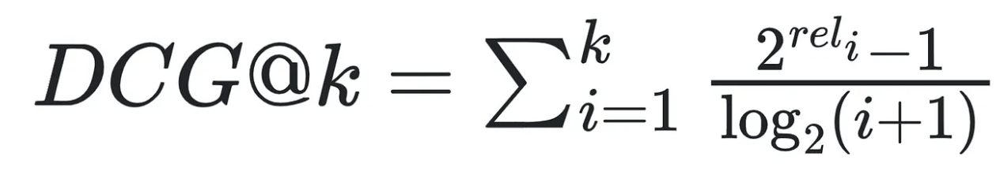
  - To compare ranking on different things => **Normalized Discounted Cumulative Gain(DCG)**
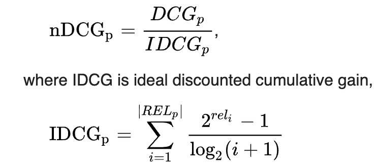
  - **ref** [Statistical Stories - NDCG (Normalized Discounted Cumulative Gain)](https://medium.com/@Currie32/statistical-stories-ndcg-normalized-discounted-cumulative-gain-0be22d61a87d)
 
#### Online
1. During the staging phase, we measure metrics such as a lift in revenue or click-through rate to evaluate how well the model recommends relevant content to users.
2. Consequently, we evaluate the impact on business metrics. If the observed revenue-related metrics show consistent improvement, it is safe to gradually expose the model to a larger percentage of real traffic.
3. Finally, when we have enough evidence that new models have improved revenue metrics, we can replace current production models with new models.

* Common Online Metrics: Click-Through Rate, Like-Through Rate, user spent time, user survey response etc..

## Sampling Strategies

### Random Sampling
While it sounds naive, it’s still very viable for many machine learning applications. For example, to collect training data for user embedding for recommending videos, we can randomly select any not-yet- seen videos from the videos repository as negative samples. 

### Rejection Sampling
* 若分布$\f(x)$难以生成，可以生成替代g(x)（如uniform, normal), 找到C 使得C >= f(x)/g(x) at any x,
  1）每一步，生成z ~ uniform(0, Cg(x)), x ~ g(x).
  2） 若z < f(x) => accept; 否则，扔掉
* **Ref** [What is Rejection Sampling?](https://towardsdatascience.com/what-is-rejection-sampling-1f6aff92330d)
  
### Weighted Sampling
If each item has an associated weight and the probability of each item to be selected is determined by these item weights, then the problem is called weighted random sampling.
**TODO**
* Weighted Sampling Algorithm
* Implementation in SQL

### Important Sampling
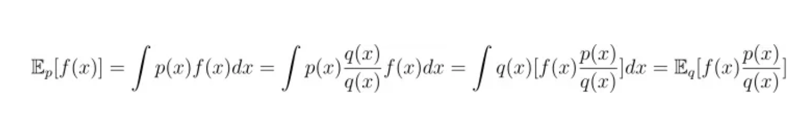
**Ref** [Importance Sampling Explained End to End](https://medium.com/@liuec.jessica2000/importance-sampling-explained-end-to-end-a53334cb330b)

#### Stratified Sampling
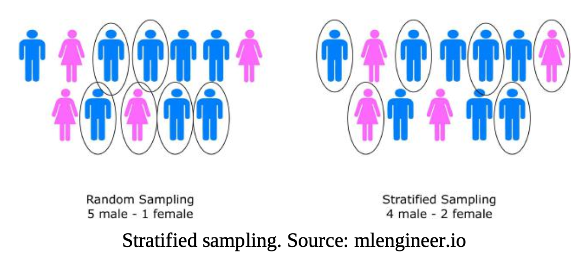

#### Reservoir Sampling
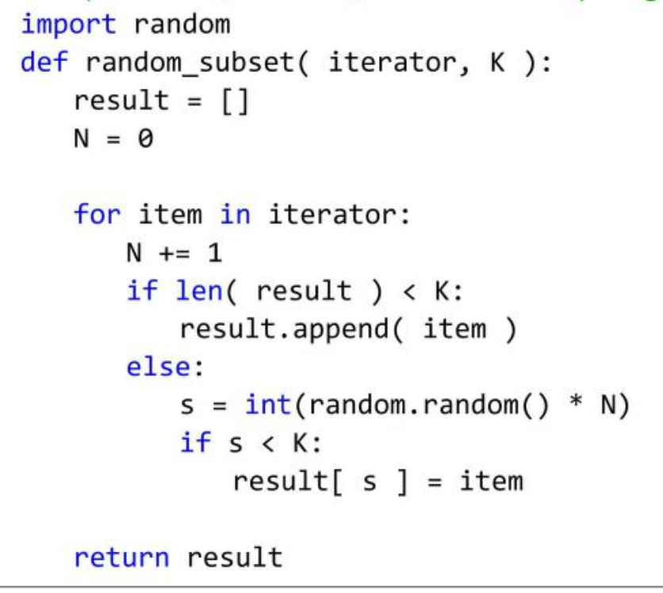

## Common Deep Learning Model Architecture
### Wide and Deep Architecture    
Wide and Deep architecture can help achieve both memorization and generalization.
* Memorization helps model to learn the frequent co-occurrence of items or features and exploiting the correlation available in the historical data.
* Generalization helps model to explore new feature combinations that rarely occurred in the past.
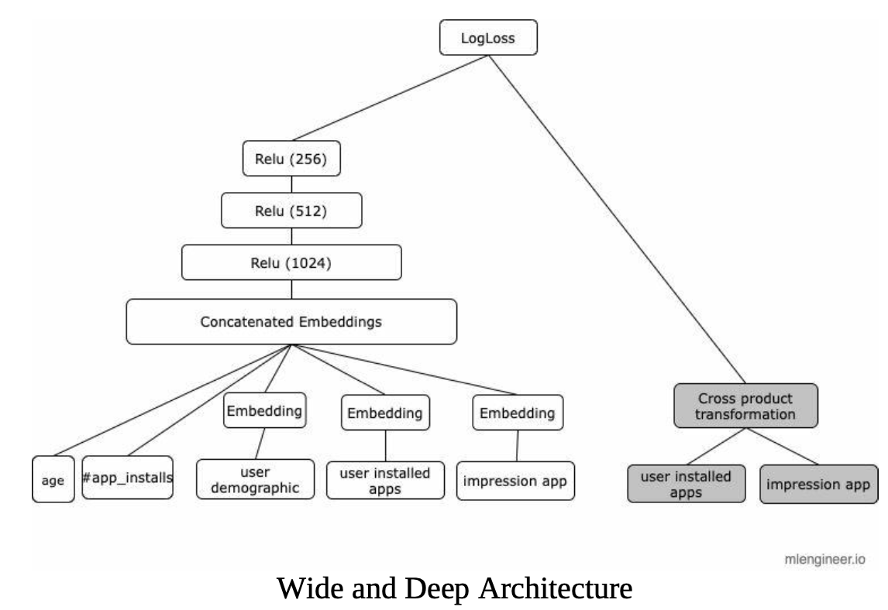

### Two Tower Achitecture
Given input data of user, context (time of day, user’s device) and items, a common solution to build a scalable retrieval model is:
* Learn query and item representations for user, context and item respectively.
* Use a simple scoring function (e.g., dot product) between query and item representations to get recommendations tailored for the query.

The representation learning problem is typically challenging in two ways:
* There are many items in the corpus: hundreds of millions of YouTube videos, millions of Places on Facebook etc.
* Long-tail problem: training data collected from users’ feedback is very sparse for most items.
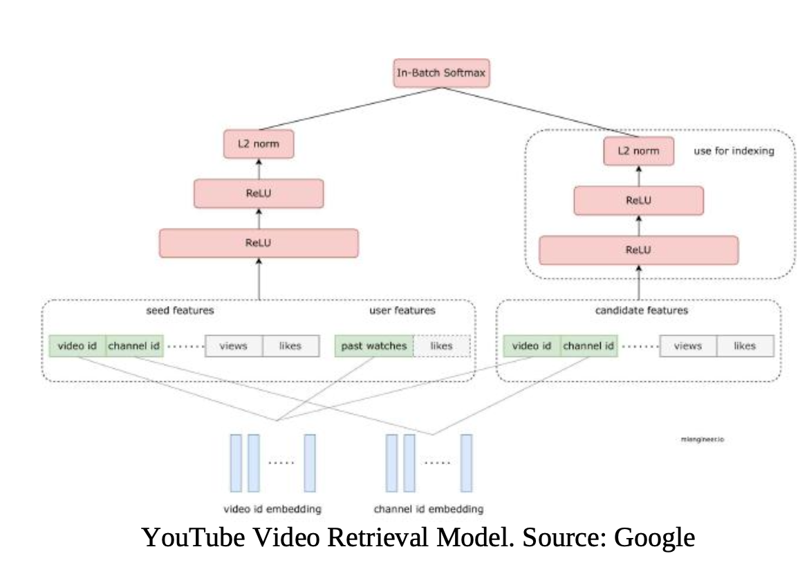

### Deep Cross Network
As we discussed in the Cross Features [crossed-features] section, we often have a lot of sparse features in web applications. For example, in an ecommerce website, we might have purchased_bananas and purchased_cooking_books features in our dataset. If a customer purchased both bananas and a cookbook, then this customer will likely be interested in purchasing a blender. We also see how Wide and Deep architecture can take advantage of cross features in [sec- wide-and-deep] section. In practice, there can be hundreds or thousands of features which make is very difficult to decide which features to use in the "wide" input of the network.
Deep Cross Network V225 (DCN) was designed to learn explicit cross features more effectively.
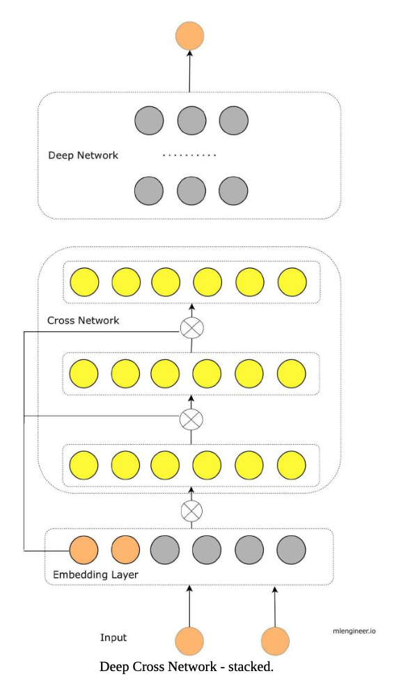
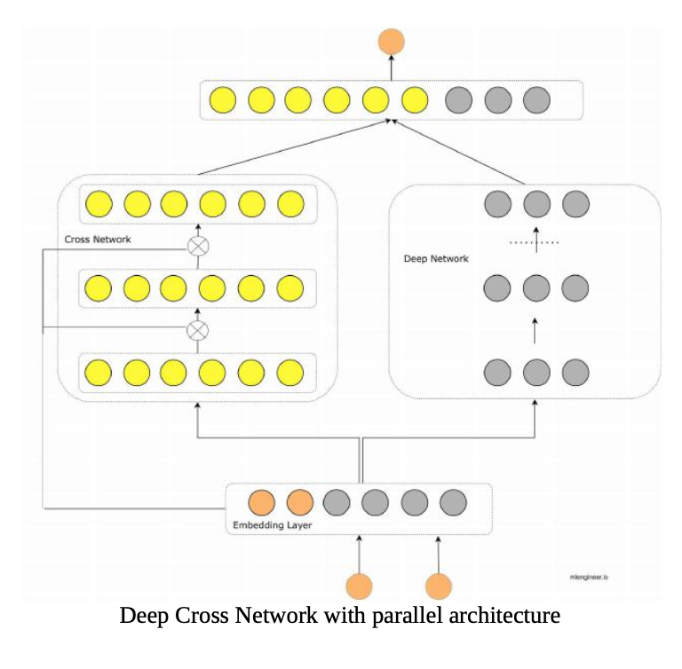

**Benefits**
* DCN v2 automatically learns cross features and improves model performance compared to traditional DL architecture.
* Google uses DCN v2 in their production use cases. When compared with A production model, DCN-V2 yielded 0.6% AUCLoss (1 - AUC) improvement. For this particular model, a gain of 0.1% on AUCLoss is considered a significant improvement.
* It’s better to insert the cross layers in between the input and the hidden layers of DNN (stacked-based).
* In practice, using two cross-layers yields the best model performance.
* Using low-rank DCN with rank (input size)/4 can preserve model accuracy.

### Multitask Learning
**Benefits**
* Share bottom layers help us leverage learned representation from other tasks.
* Train model and ability for multiple tasks.
* We can also combine p(like) and p(comment) in the ranking phase, e.g, rank items based on weighted combination of p(like) and p(comment).

How can you “blend” results together? For example, videos and photos have very different distribution for possible actions (like/comment).
Read more Lessons learned at Instagram26.
`How Instagram “blend” video and photos in their recommendations? Instagram maps the probability (such as p(like)) to a reasonably well-behaved distribution such as a Gaussian. Now it’s straightforward to compare and blend the results.`

### An Example
#### Facebook Deep Learning Recommendation Model (DLRM)**
**Requirements and Data**
Recommend products to people, for example, which qualified ads to show to Facebook users. In this problem, we want to maximize the engagements, such as increasing the Click-through rate (CTR).
**Metrics**
We utilize accuracy, AUC since our use case is binary classification: if the user clicks or does not click on a particular product.
**Features**
* Categorical features: went through embedding layers with the same dimensions as we described in [subsec-embedding] section.
* Continuous features: went through a multilayer perceptron (MLP), which will yield a dense representation of the same length as the embedding vectors.
**Model**
DL for recommendation
Op here can be concat, dot product or sum.
After all features are transformed through MLP, we apply Op and the output will be transformed through another MLP.
Finally, we fed the output through the Sigmoid layer.

## A/B Testing Fundamental
There are two popular ways to perform A/B testing: general A/B testing and budget-splitting A/B testing. In normal A/B testing, users are split into two groups: control and treatment. The control group contained users with the current production model and the treatment group contained users with the new model. One problem with this setting is in Ads Marketplace industry, it’s common to see control groups and treatment groups "fight" for the same budget. So during the test, when we observed increase “revenues” it can simply mean budget “shift” between groups.  One solution is budget-splitting. (**TODO: 不理解**）
* **Budget-Splitting**
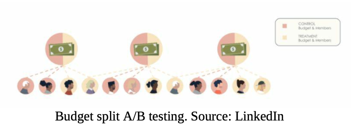
* First, we split members into control group and treatment group. Each group has the same number of members.
* Then, we split the budget of each ad campaign into two “sub- campaigns”. Each “sub-campaign” has 50% of the original campaign’s budget.
* Finally, we assign one of these sub-campaigns to the treatment member group and the other to the control member group.

  
**Benefits**
The two sub-campaigns act independently, so they can’t compete for budget between treatment and control members.
 These tests run with a large member population, which improves the statistical significant of our experiment.

## Common Deployment Patterns
### Imbalance Workload
We usually use similar architecture in Load Balancer, which is also sometimes called Aggregator Service or Broker.
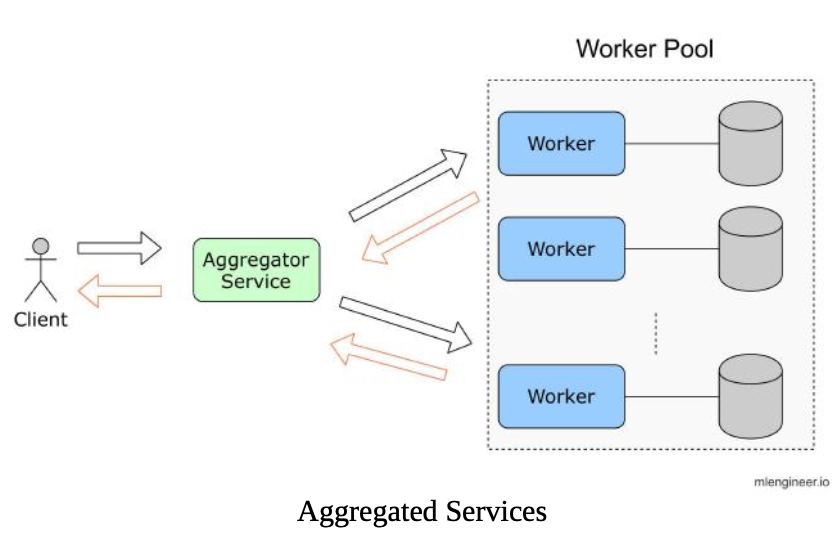

* Client (upstream process) sends request to Aggregator Service.
* If workload is too high, Aggregator Service splits the workload and assigns to some workers in the Worker pool.
* Aggregator Service can pick workers by workload, round-robin, or request parameter.
Wait for response from workers. Forward response to client.

### Serving Logics and Multiple Models
For any business driven system, it’s important to be able to change logic in serving models. For example, depending on the type of Ads candidates, we will route to a different model to get a score. In practice, we can sometime see multiple models, each model serve some specific cohorts of users. The disadvantage is that it increases complexity, and we might not have enough data to train multiple models.
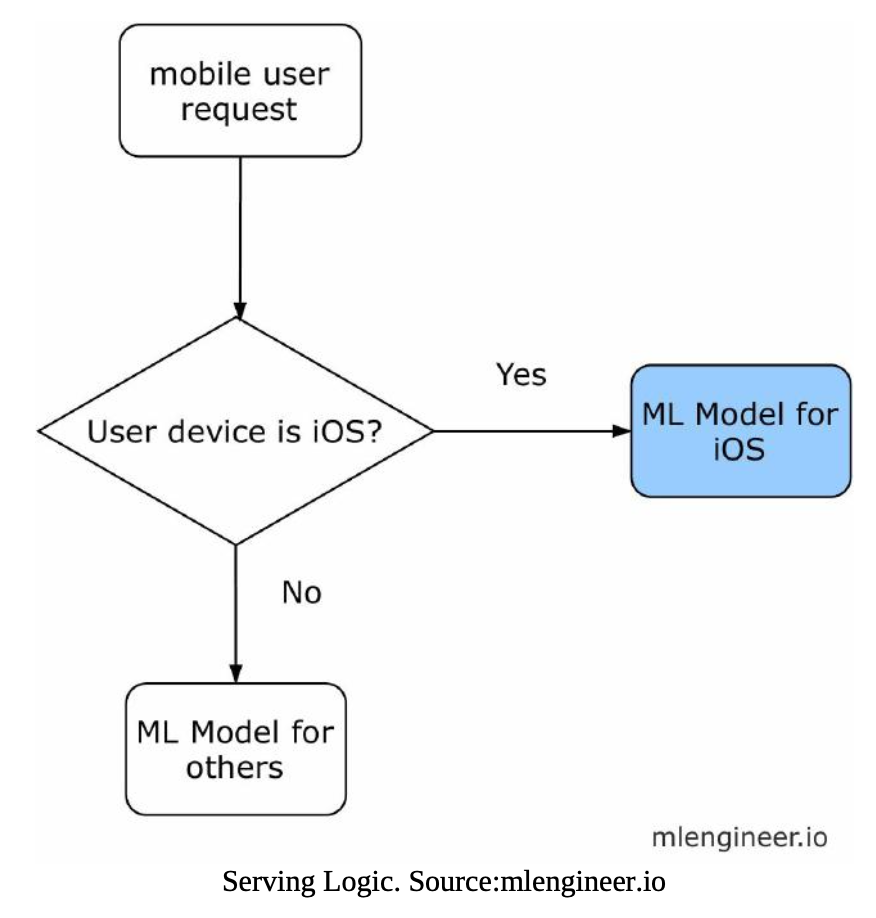

### Offline Serving
* Once the model is trained, we have two subgraphs: one subgraph for the user and one subgraph for the job posting.
* The subgraphs are versioned, packaged, and distributed for offline serving.
* Then, we stored precomputed embeddings in Frame Feature Marketplace.

### Nearline Serving
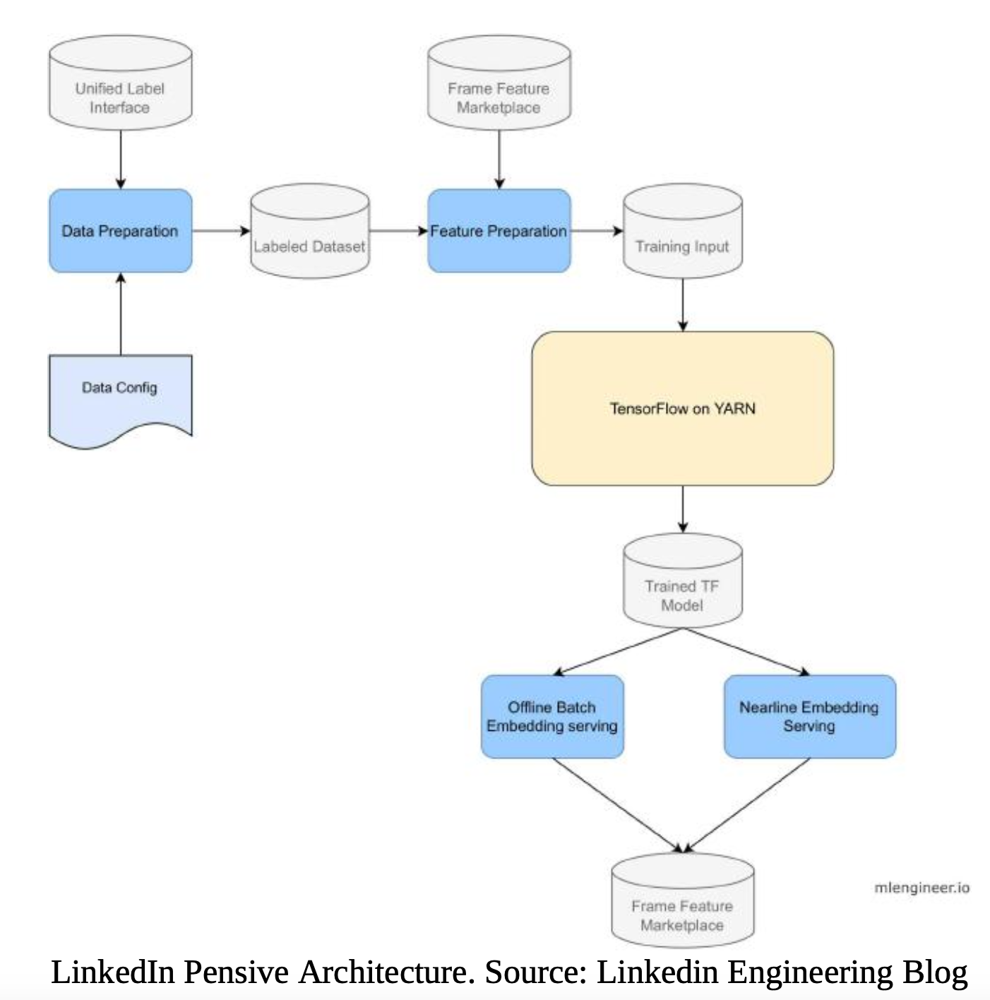
When a job is posted, a nearline feature standardization process runs and produces input for the embedding model.
Once standardization processes are completed, all registered models are loaded and executed in parallel.
Once we have the embeddings, we batch and store them in key-value storage and Kafka topic to be published in Frame Feature Marketplace.

### Approximate Nearest Neighbor Search
One popular application of embedding is approximate nearest neighbor search (ANN). For a large dataset with hundreds of millions or billions of items (e.g., users, movies, etc.), searching for similar objects based on their embeddings is challenging. There are two common libraries: Facebook AI Similarity Search (FAISS31) and Google ScaNN32.

### An Example
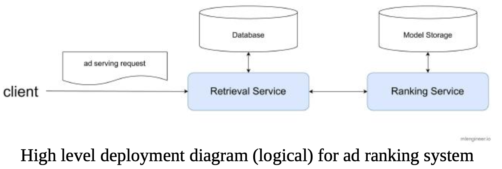
* Database: stores ad campaign data, ad creative data, and user information, etc.
* Model Storage: stores persisted machine learning model. One example is to store a trained model in AWS S3 with timestamps so the ranking service can pull the latest model.
* It’s desirable to have a separated retrieval service and ranking service because they usually have different scalability requirements. In practice, they are usually built by different teams with different technical stacks.
In Ad ranking use cases, we typically have less frequently changed features (user home country) and frequently changed features (number of clicks in the last 3 hours, last 24 hours, etc). One way to update near real time features is to use Amazon DynamoDB.

**Why don’t we prepare input data in the ranking service? **
* Pros:
  - Make it easier to release versioned and ship models. With a framework like TensorFlow Transform, we can encapsulate all feature processing steps in TensorFlow Graph.
  - Make it easier to change the backend database without affecting any machine learning models. Decouple the retrieval service with ranking service, therefore, improving overall system throughput and latency.
* Cons: Prone to training-serving skew, for example: data is processed differently between training and serving.

**How do we handle training-serving skew? **
One simple solution is to log all processed data into log files.
**What if the logged files are too big, and we run out of disks?**
One simple solution is to use log rotating. In Kubernetes, you can redirect any output generated to a containerized application’s stdout and stderr streams. For example, the Docker container engine redirects those two streams to a logging driver, which is configured in Kubernetes to write to a file in JSON format. There are three options to implement this:
* Option 1: Use a node-level logging agent that runs on every node.
* Option 2: Include a dedicated sidecar container for logging in an application pod.
* Option 3: Push logs directly to a backend from within an application.

**How do we scale the retrieval service? What if we have too many requests?**
* Option 1: Manually tune a fixed number of pods/instances on the cluster
* Option 2: Use Kubernetes autoscaling. We have two options: 1. Demand base if requests > threshold then scale up; scale down using cool down events. 2. Other auto scaling modes based on CPU or memory metrics are less effective.
* To make autoscaling work, we need to have:
  - Retrieval service and other down-stream tasks are stateless.
  - All services must support graceful shutdown otherwise, we won’t know how to store states.
  - Service should have similar performance instances.
  - Load balancer is NOT a single point of failure. It’s usually downstream services that are the bottlenecks.
Concretely, one Kubernetes pod will look like this:
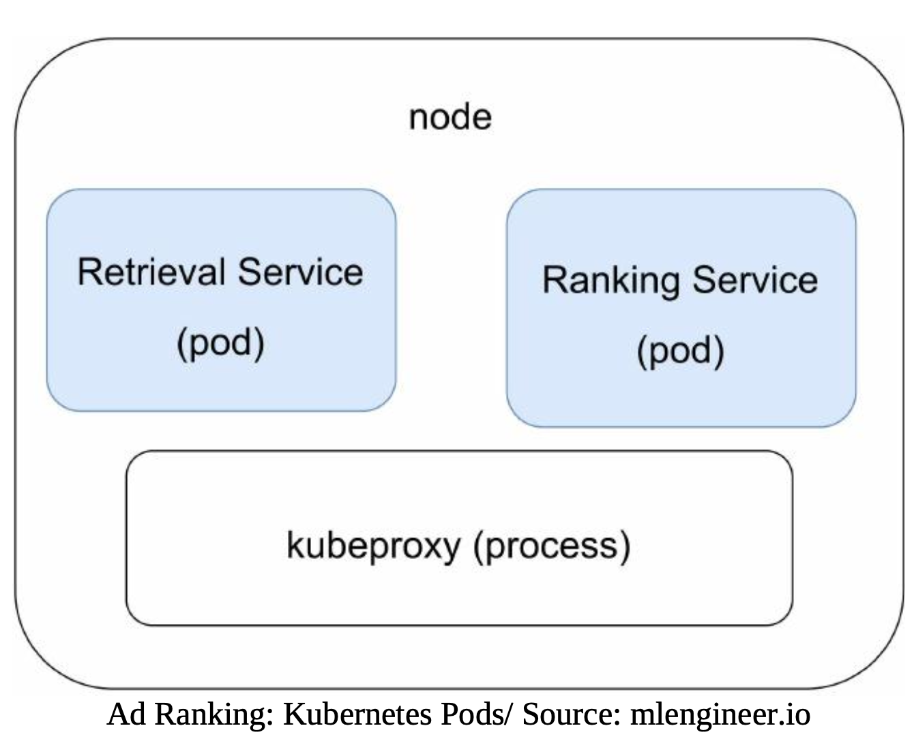

### An Example
#### Spotify: one simple mistake took four months to detect
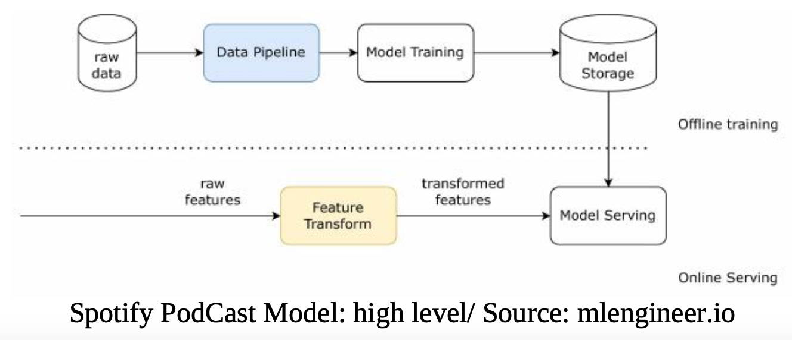
* Training pipeline reads raw data, performs feature transformation, train model and save model to Model Storage.
* Online serving: a recommendation service (run on different infrastructure), transform feature then give predictions.
* Problem arises when Feature Transform in Online Serving is implemented differently.
* As a result, input data is different during training vs. serving. This **training-serving skew problem** is very common in practice, especially when serving is implemented by different teams.
* The discrepancy implementation is just a few lines of code but it impacts model recommendations severely. This issue happened for four months before they can detect it.
  
**Solutions**
There are two main solutions: 1/ one transformation for both training and serving and 2/ use feature logging. Spotify decides to use feature logging (see 1.5 diagram).
* Implement feature transform in Java.
* Log already transformed features at serving stage. _This is important because the up-stream service used for feature transform is owned by different teams. If we log features at up-stream services, it’ll be difficult for Machine Learning team to own and make any changes._
* Feature logs will be used later for training.
* Distribution Monitoring: Use Tensorflow Data Validation (TFDV) to compare training and serving data schemas and feature distribution regularly. Set up alert to detect feature drift (using Chebyshev distance metric).

  

